# Text-to-Painting Generation using Actor-Critic Methods with PPO

## Abstract
We propose a Proximal Policy Optimization (PPO) actor-critic framework for text-to-painting
generation using a stroke-based neural renderer, requiring no paired training data
or large-scale pretraining. The agent learns solely through trial-and-error, guided
by a vision-language reward signal derived from the cosine similarity between the
evolving canvas and the input text prompt. We conduct a systematic study of three
vision-language models as reward signals, CLIP, OpenCLIP, and SigLIP, and evaluate each 
agent variant across all three metrics to assess cross-metric generalization. 


## Getting Started

```bash
git clone https://github.com/sarryWehbe/text-to-painting-generation-ppo.git
```

## Dependencies

* [PyTorch](http://pytorch.org/)
* [NumPy](https://numpy.org/)
* [Pillow](https://python-pillow.org/)
* [Matplotlib](https://matplotlib.org/)
* [OpenAI CLIP](https://github.com/openai/CLIP)
* [OpenCLIP](https://github.com/mlfoundations/open_clip)
* [Transformers](https://huggingface.co/docs/transformers)

```bash
pip install torch
pip install numpy
pip install Pillow
pip install matplotlib
pip install git+https://github.com/openai/CLIP.git
pip install open_clip_torch
pip install transformers
```

## Testing
Make sure you have renderer.pkl before testing.

You can download a trained neural renderer for test: [renderer.pkl](https://drive.google.com/open?id=1-7dVdjCIZIxh8hHJnGTK-RA1-jL1tor4), 
[triangle.pkl](https://drive.google.com/open?id=1YefdnTuKlvowCCo1zxHTwVJ2GlBme_eE) ,
or [round.pkl](https://drive.google.com/open?id=1kI4yXQ7IrNTfjFs2VL7IBBL_JJwkW6rl)

---

## Usage

### Training

The easiest way to run the code is to open the relevant notebook and run 
all cells sequentially:

| Notebook | Reward signal |
|---|---|
| `clip_model.ipynb` | CLIP ViT-B/32 |
| `openclip_model.ipynb` | OpenCLIP ViT-B/32 |
| `siglip_model.ipynb` | SigLIP |

To change the text prompt, edit the `--prompt` argument in the arguments 
cell at the top of the notebook:

```python
--prompt "A painting of a red apple"
```

Training runs for 5,000 episodes per prompt and takes approximately 10 
minutes. The best canvas is saved to `outputs/best.png` and a training 
curve to `outputs/training_curve.png`.

### Evaluation

To evaluate a saved checkpoint and generate a GIF of the painting process, 
change `--eval` to `store_true` in the arguments cell:

```python
parser.add_argument("--eval", action="store_false")
```

Then re-run the notebook. The evaluation GIF will be saved to 
`outputs/drawing.gif`.

Alternatively, if running the `.py` script from the command line:

```bash
# Training
python train.py --prompt "A painting of a red apple" --episodes 5000 --device auto

# Evaluation
python train.py --eval --prompt "A painting of a red apple" --device auto
```

### Arguments

| Argument | Default | Description |
|---|---|---|
| `--prompt` | `"A painting of a red apple"` | Text prompt to paint |
| `--episodes` | `5000` | Number of training episodes |
| `--save_dir` | `outputs` | Directory to save results |
| `--renderer` | `renderer.pkl` | Path to neural renderer weights |
| `--device` | `auto` | Device: `auto`, `cpu`, `cuda`, or `mps` |
| `--eval` | `False` | Run evaluation on a saved checkpoint |

---

## Results

Sample outputs for four prompts across all three agent variants:

| Prompt | CLIP agent | OpenCLIP agent | SigLIP agent |
|---|---|---|---|
| Blue flower | 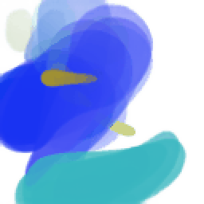 | 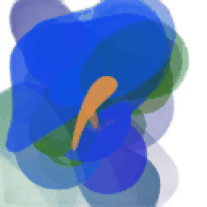 | 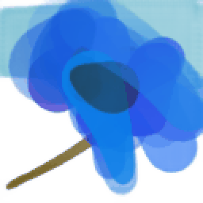 |
| Sunflower | 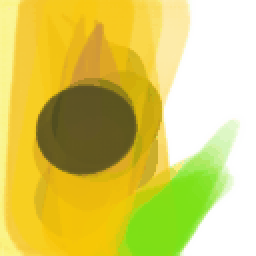 | 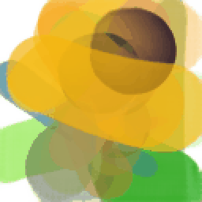 | 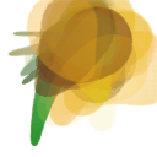 |
| Grapes | 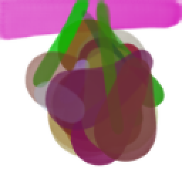 | 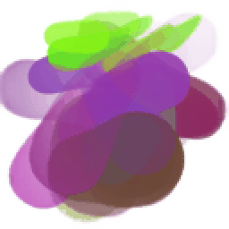 | 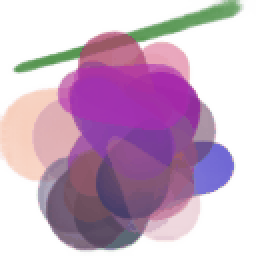 |
| Red apple | 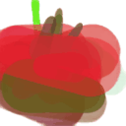 | 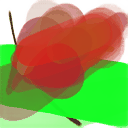 | 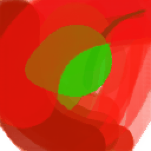 |

---


